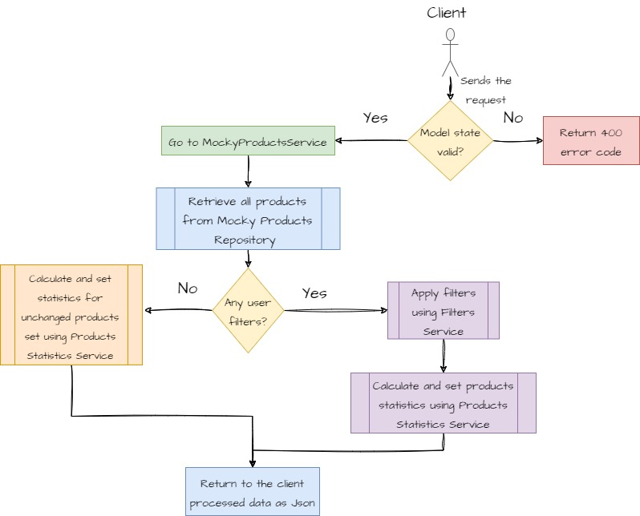
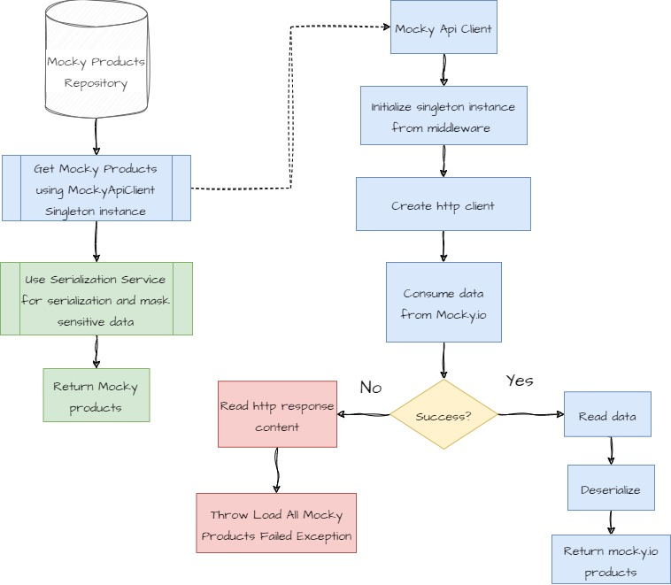
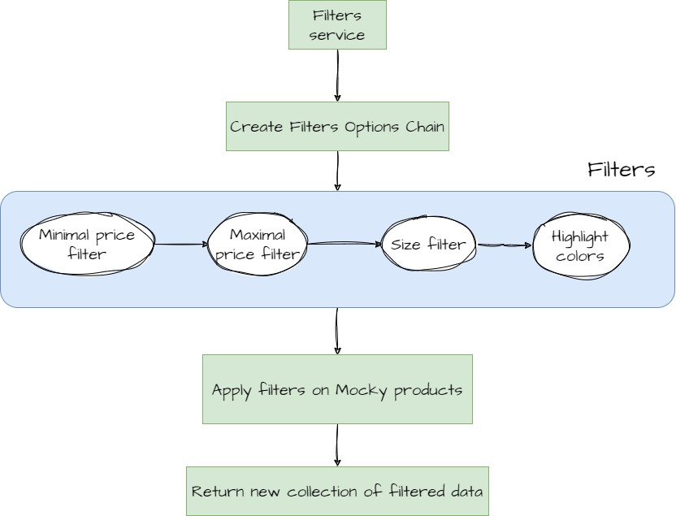
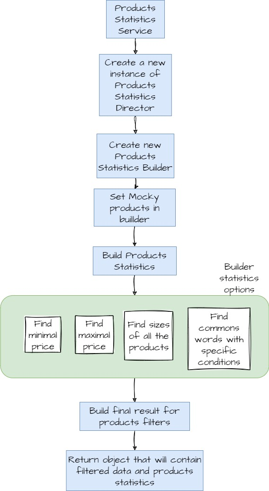

# Products store API
## _Introduction_
This API retrieves products data from mocky.io, then applies to them some client's filters, and adds some statistics based on those data.

## Technologies Used

This  API leverages a variety of technologies to deliver its functionality efficiently and effectively:

- **Mocky.io**: An external API serving as a data source for mock product information. It plays a crucial role in retrieving product data for our API.

- **Serilog**: A robust logging library that enhances our API's logging capabilities. Serilog allows us to log information, errors, and other relevant events for easier troubleshooting and monitoring.

- **Fluent Validation**: A powerful validation library that assists in validating input models. We utilize Fluent Validation to ensure that incoming data meets the specified requirements before processing.

- **AutoMapper**: A versatile mapping library that streamlines the process of converting data between different models. AutoMapper aids us in efficiently transforming data between our internal representations and the responses sent to clients.

These technologies collectively contribute to the reliability, maintainability, and performance of our API.

## Getting Started:
To compile and run the ASP.NET Core Web API, you'll need the minimum necessary tools to build and execute the code.
1. Install .NET SDK
2. Clone or download the API Repository
3. Navigate to the Project Directory
4. Build and Run the Application
5. Access the API

## Endpoints
### Filtering Items Endpoint

This endpoint allows you to filter items based on various criteria.

#### Endpoint

- **Route 1**: `POST /filter`
- **Route 2**: `POST /`

Both routes can be used to get products.

#### Request

- **Method**: `POST`
- **Content Type**: `application/json`

#### Query Parameters

You can include the following query parameters to filter items:

- `minprice` (optional): The minimum price of items.
- `maxprice` (optional): The maximum price of items.
- `size` (optional): The size of items (e.g., small, medium, large).
- `highlight` (optional): The highlight colors of items with matching description (e.g., green, blue).


#### Example

```json
POST /filter?minprice=5&maxprice=20&size=medium&highlight=green,blue
Content-Type: application/json
```
## Filtering Items Endpoint - Response Format

The response from the filtering items endpoint will be returned in JSON format. The structure of the response will depend on the presence of query parameters and the filtering criteria used.

### Response Structure

The response can contain the following elements:

- `products` (array, optional): An array containing product details based on the applied filters.

- `filter` (object, optional): A filter object containing the following information:

  - `minPrice` (number): The minimum price of all products in the source URL.
  - `maxPrice` (number): The maximum price of all products in the source URL.
  - `sizes` (array of strings): An array containing all sizes of all products in the source URL.
  - `commonWords` (array of strings): A string array containing the most common words in all product descriptions, excluding the most common five.

### Example Response

```json
HTTP/1.1 200 OK
Content-Type: application/json

{
  "products": [
    {
      "title": "A Red Trouser",
      "price": 10,
      "sizes": ["small", "medium", "large"],
      "description": "This trouser perfectly pairs with a <em>green</em> shirt."
    },
    // ... other products
  ],
  "filter": {
    "minPrice": 10,
    "maxPrice": 20,
    "sizes": ["Small, Medium, Large", "Medium", ...],
    "commonWords": ["shirt", "hat", ...]
  }
}
```
## Application Architecture: Onion Architecture

This API follows the Onion Architecture pattern, which is designed to promote separation of concerns and maintainability by organizing the application into concentric layers with clear dependencies.


### Domain Layer

- Contains the core domain logic, entities, and business rules (Abstractions, Builders, Contracts, Filters and others.).
- Isolated from external concerns.

### Application Layer

- Acts as an intermediary between the core layer and external interfaces.
- Coordinates application functionality and uses services from the core layer.
- Contains Dtos, Helpers, Services and Validators

### Infrastructure Layer

- Provides implementations for external concerns such as data access, and external services.
- Depends on the core and application layers.
- Contains Middleware, OpenApi settings, Repositories

### API Layer

- Represents RESTful API interface.
- Handles HTTP requests and interacts with the application layer to serve the API endpoints.
- Contains Controllers, Configurations and application's startup settings.

## Request Processing Flow

When a client sends an HTTP request to the API, the following steps outline the request processing flow:

1. **Validate Model State**:
   - If the model state of the incoming request is not valid, the API will return a 400 Bad Request error code.

2. **Retrieve Products**:
   - If the model state is valid, the API will retrieve all products from the Mocky Products Repository using the Mocky Products Service.

3. **Apply Filters (if applicable)**:
   - If the client included filter parameters in the URL's query, the Filters Service will be invoked to apply the specified filters to the products.

4. **Calculate Products Statistics**:
   - The Products Statistics Service will calculate and set statistics related to the products.
   - If filters were applied, the statistics will be calculated based on the filtered products.
   - If no filters were applied, the statistics will be calculated using the unchanged products set.

5. **Return Processed Data**:
   - The API will return the processed data in JSON format to the client.

This flow is visualized in the diagram below:



## Mocky Products Repository and Mocky Api Client

In the context of our API's architecture, the "Mocky Products Repository" and the "Mocky Api Client" play integral roles in retrieving and processing data.

### Mocky Products Repository

The Mocky Products Repository is responsible for managing and providing access to mock product data. It is utilized as follows:

1. **Retrieval from Mocky Api Client**:
   - The Mocky Products Repository utilizes the Mocky Api Client Singleton instance to retrieve all Mocky products.
   - The Mocky Api Client's functionality is further explained below.

2. **Serialization and Logging**:
   - Once the products are retrieved from the Mocky Api Client, the Serialization Service is employed to serialize the data.
   - Sensitive data is masked before being logged to the console.

3. **Returning Mocky Products**:
   - Mocky products are then returned by the Mocky Products Repository.

### Mocky Api Client

The Mocky Api Client is a Singleton instance instantiated from middleware. Its primary purpose is to retrieve data from Mocky.io:

1. **HTTP Client Creation**:
   - The Mocky Api Client creates an HTTP client instance for making requests to external APIs.

2. **GET Request to Mocky.io**:
   - Using the HTTP client, the Mocky Api Client sends a GET request to Mocky.io to retrieve product data.

3. **Response Handling**:
   - If the GET request is successful, the response data is read and deserialized, resulting in mocky.io products being returned.
   - In case of an unsuccessful response, the HTTP response content is read and a "Load All Mocky Products Failed Exception" is thrown.

This functionality is visualized in the diagram below:



## Filters Service

The "Filters Service" plays a vital role in handling user input from the URL query and applying filters to the mocky products. It creates a structured chain of filtering options, each responsible for applying a specific filter. The service's functionality is outlined below:

1. **User Input Handling**:
   - The "Filters Service" receives user input from the URL query parameters, such as `/filter?minprice=5&maxprice=20&size=medium&highlight=green,blue`.

2. **Filter Chain Creation**:
   - Based on the user's desires, the service creates a chain of filter options. Each option corresponds to a specific filter, such as Minimal Price Filter, Maximal Price Filter, Size Filter, and Highlight Colors Filter.

3. **Filter Application Chain**:
   - Once the filter chain is established, the service processes each filter option in sequence. The chain processes filters in the following order:
     1. Minimal Price Filter
     2. Maximal Price Filter
     3. Size Filter
     4. Highlight Colors Filter

4. **Collection Modification**:
   - As each filter option is processed, it applies its corresponding filter to the collection of mocky products. The modified collection is then passed to the next filter option in the chain.

5. **Filtered Collection Return**:
   - After all filters have been applied, the "Filters Service" returns the new filtered collection of mocky products.

This functionality is visualized in the diagram below:



## Products Statistics Service

The "Products Statistics Service" is responsible for generating statistics based on the products received from the "Products Statistics Builder." This service facilitates the creation of product statistics with the following functionalities:

1. **Products Statistics Director and Builder Interaction**:
   - The "Products Statistics Service" initiates the creation of statistics through the "Products Statistics Director" and "Products Statistics Builder."
   - The "Products Statistics Director" is responsible for managing the construction process of statistics using the builder.

2. **Builder Parameterization**:
   - The "Products Statistics Builder" is instantiated with a parameter, which is the set of mocky products that were filtered or not, based on customer input.

3. **Statistics Building**:
   - The builder constructs the statistics, including:
     - The minimum and maximum price of all products in the source URL.
     - An array of strings containing all sizes of all products in the source URL.
     - A string array of size ten containing the most common words in all product descriptions, excluding the most common five.

4. **Data Structure Creation**:
   - The "Products Statistics Builder" assembles the collected statistics into a structured object.

5. **Return of Filtered Data and Statistics**:
   - The "Products Statistics Service" returns an object that contains the filtered data and the calculated products statistics.

This functionality is visualized in the diagram below:

